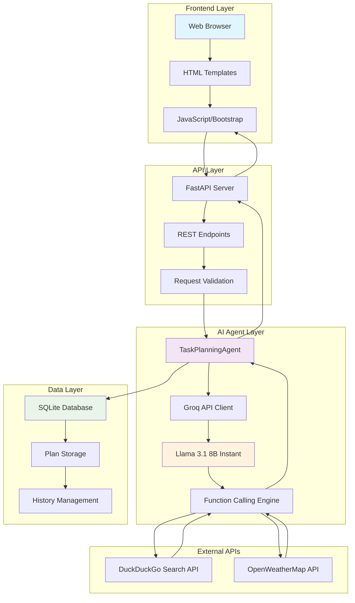
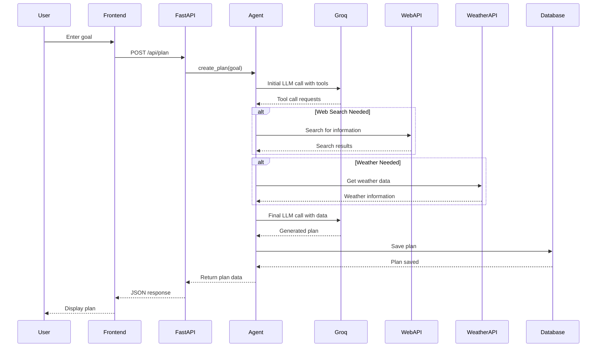
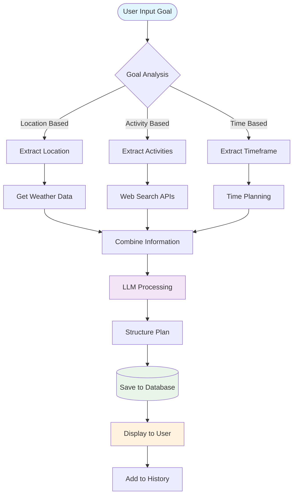
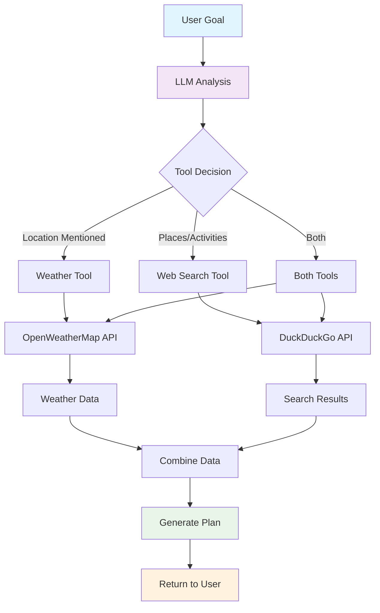

# AI Task Planning Agent

An intelligent AI agent that transforms natural language goals into detailed, actionable plans using LLM capabilities and external APIs.

## 🚀 **Quick Start**

```bash
# 1. Clone and setup
git clone <repository-url>
cd ai-task-planning-agent

# 2. Create virtual environment
python -m venv venv
venv\Scripts\activate  # Windows
# source venv/bin/activate  # macOS/Linux

# 3. Install dependencies
pip install -r requirements.txt

# 4. Set up API keys
# Create .env file with:
# GROQ_API_KEY=your_groq_api_key_here

# 5. Run the application
python run.py

# 6. Open browser to: http://localhost:8000
```

## How It Works

The AI Agent follows this comprehensive workflow:

1. **Goal Input**: User provides a natural language goal
2. **LLM Processing**: Llama 3.1 8B Instant analyzes the goal and determines what information is needed
3. **Tool Calling**: Agent uses web search and weather APIs to gather external data
4. **Plan Generation**: LLM creates a structured, day-by-day plan with gathered information
5. **Database Storage**: Plan is saved for future reference
6. **Web Interface**: Users can view plans and browse history

## System Architecture



### Detailed Component Interaction



### Component Details

#### **Frontend Layer**
- **Web Browser**: Modern browser rendering the responsive interface
- **HTML Templates**: Jinja2 templates for dynamic content rendering
- **JavaScript/Bootstrap**: Interactive UI with Bootstrap styling and AJAX requests

#### **API Layer**
- **FastAPI Server**: High-performance async web framework
- **REST Endpoints**: RESTful API design with proper HTTP methods
- **Request Validation**: Pydantic models for data validation and serialization

#### **AI Agent Layer**
- **TaskPlanningAgent**: Core planning engine with tool integration
- **Groq API Client**: HTTP client for communicating with Groq's API
- **Llama 3.1 8B Instant**: Large language model for natural language understanding
- **Function Calling Engine**: Handles tool selection and execution

#### **External APIs**
- **DuckDuckGo Search API**: Web search for real-time information gathering
- **OpenWeatherMap API**: Weather data for location-based planning

#### **Data Layer**
- **SQLite Database**: Lightweight, file-based database for plan storage
- **Plan Storage**: Structured storage of goals and generated plans
- **History Management**: Query and retrieval of historical plans

### API Endpoints

```mermaid
graph LR
    A[GET /] --> B[Main Page]
    C[POST /api/plan] --> D[Create Plan]
    E[GET /api/plans] --> F[List Plans]
    G[GET /api/plans/{id}] --> H[Get Specific Plan]
    I[GET /history] --> J[History Page]
    K[GET /health] --> L[Health Check]
    M[GET /docs] --> N[API Documentation]
    
    style A fill:#e3f2fd
    style C fill:#f3e5f5
    style E fill:#e8f5e8
    style G fill:#fff3e0
```

### Data Flow Architecture



### Tool Integration Flow



## Features

- **Natural Language Processing**: Understands complex goals and breaks them into actionable steps
- **Web Search Integration**: Gathers current information about places, activities, restaurants
- **Weather Integration**: Includes weather data for location-based plans
- **Database Storage**: SQLite database for persistent plan storage
- **Web Interface**: Modern, responsive UI for goal input and plan viewing
- **Plan History**: Browse and revisit all previously created plans
- **Debug Logging**: Console output shows tool calls and API responses for troubleshooting

## Setup Instructions

### Prerequisites

- Python 3.8+
- Groq API key
- OpenWeather API key (optional, for weather features)

### Installation

1. **Clone the repository**
   ```bash
   git clone <repository-url>
   cd ai-task-planning-agent
   ```

2. **Create and activate a virtual environment**
   ```bash
   # Create virtual environment
   python -m venv venv
   
   # Activate virtual environment
   # On Windows:
   venv\Scripts\activate
   
   # On macOS/Linux:
   source venv/bin/activate
   ```

3. **Install dependencies**
   ```bash
   python -m pip install -r requirements.txt
   ```

4. **Set up environment variables**
   
   Create a `.env` file in the project root:
   ```env
   GROQ_API_KEY=your_groq_api_key_here
   OPENWEATHER_API_KEY=your_openweather_api_key_here
   ```

5. **Run the application**
   ```bash
   python run.py
   ```

6. **Access the web interface**
   
   Open your browser and go to: `http://localhost:8000`

**Note**: To deactivate the virtual environment when you're done, simply run:
```bash
deactivate
```

### API Keys Setup

- **Groq API Key**: Get from [Groq Console](https://console.groq.com/keys)
- **OpenWeather API Key**: Get from [OpenWeatherMap](https://openweathermap.org/api) (optional)

## Example Goals and Generated Plans

### Example 1: "Plan a 2-day vegetarian food tour in Hyderabad"

**Generated Plan:**
```
Day 1: Exploring Traditional Vegetarian Delights

Morning (9:00 AM - 12:00 PM):
- Start at Chutney's Restaurant, Banjara Hills
  - Famous for South Indian thali and dosas
  - Try their special Andhra thali with unlimited servings
  - Cost: ₹300-400 per person
  - Weather: 28°C, sunny - perfect for morning food tour

Afternoon (1:00 PM - 4:00 PM):
- Visit Paradise Restaurant, Secunderabad
  - Iconic biryani and traditional Hyderabadi vegetarian dishes
  - Must-try: Vegetable Dum Biryani and Haleem
  - Cost: ₹400-500 per person

Evening (6:00 PM - 9:00 PM):
- Explore street food at Charminar area
  - Mirchi bajji, samosas, and traditional sweets
  - Visit Pista House for famous haleem (vegetarian version)

Day 2: Modern Vegetarian Experiences

Morning (9:00 AM - 12:00 PM):
- Breakfast at Minerva Coffee Shop
  - Traditional South Indian breakfast
  - Famous for their coffee and idli-sambar

Afternoon (1:00 PM - 4:00 PM):
- Visit Ohri's Jiva Imperia
  - Contemporary vegetarian fine dining
  - Multi-cuisine vegetarian options
  - Cost: ₹800-1000 per person

Evening (6:00 PM - 9:00 PM):
- Dessert tour at Nampally area
  - Traditional Indian sweets and modern desserts
  - Visit local sweet shops for authentic flavors
```

### Example 2: "Organize a 5-step daily study routine for learning Python"

**Generated Plan:**
```
Daily Python Learning Routine (5 Steps)

Step 1: Morning Theory (30 minutes - 8:00 AM)
- Review Python concepts from previous day
- Read documentation or tutorials
- Focus on one specific topic per day
- Tools: Python.org docs, Real Python, or Python Crash Course

Step 2: Hands-on Practice (45 minutes - 9:00 AM)
- Code along with tutorials
- Practice basic syntax and data structures
- Use interactive platforms: Codecademy, freeCodeCamp, or Python.org tutorial

Step 3: Project Work (60 minutes - 10:30 AM)
- Build small projects applying learned concepts
- Start with simple scripts, gradually increase complexity
- Examples: Calculator, to-do list, weather app

Step 4: Problem Solving (30 minutes - 2:00 PM)
- Solve coding challenges on platforms like:
  - LeetCode (easy problems)
  - HackerRank
  - Codewars
- Focus on algorithms and problem-solving thinking

Step 5: Review and Documentation (15 minutes - 6:00 PM)
- Review what you learned today
- Write notes or update learning journal
- Plan tomorrow's learning goals
- Document any challenges or breakthroughs

Weekly Goals:
- Complete 1-2 small projects
- Solve 10-15 coding problems
- Review and reinforce weak areas
- Connect with Python community online
```

## 🌤️ Weather-Integrated Planning Examples

The following examples demonstrate how the AI agent intelligently uses weather data to create location-aware plans:

### Example 3: "Plan a 3-day hiking and outdoor adventure trip to Shimla with mountain trails, local sightseeing, and traditional food. Include weather considerations for outdoor activities."

**Expected Weather Integration:**
- Agent detects "Shimla" location and calls weather API
- Gets current temperature, conditions, humidity, and wind speed
- Incorporates weather data into hiking recommendations
- Suggests optimal timing based on weather conditions

### Example 4: "Create a 4-day beach vacation plan for Goa including water sports, beach activities, local restaurants, and cultural sites. Consider weather conditions for optimal timing."

**Expected Weather Integration:**
- Weather API call for coastal conditions in Goa
- Wind speed data for water sports safety recommendations
- Temperature and humidity for beach activity timing
- Weather-appropriate activity suggestions

### Example 5: "Plan a 2-day exploration of Delhi with visits to historical monuments, local markets, street food tours, and parks. Include weather-appropriate clothing suggestions and timing."

**Expected Weather Integration:**
- Delhi weather data for outdoor monument visits
- Temperature-based timing for market exploration
- Humidity considerations for street food tours
- Weather-appropriate clothing recommendations

### Example 6: "Organize a weekend trip to Kerala during monsoon season with indoor and outdoor activities, local cuisine, and cultural experiences. Plan around weather patterns."

**Expected Weather Integration:**
- Monsoon weather patterns for Kerala
- Indoor/outdoor activity balance based on rainfall
- Weather-safe timing for cultural experiences
- Monsoon-specific recommendations

### Example 7: "Plan a 5-day winter trip to Manali with skiing, snow activities, local Himachali food, and sightseeing. Include weather considerations for safety and comfort."

**Expected Weather Integration:**
- Winter weather data for Manali
- Temperature considerations for skiing activities
- Wind conditions for outdoor safety
- Winter clothing and gear recommendations

### Example 8: "Create a plan for attending Diwali celebrations in Jaipur with outdoor festivities, markets, traditional food, and cultural shows. Consider evening weather for outdoor events."

**Expected Weather Integration:**
- Jaipur weather data for evening events
- Temperature for outdoor festival comfort
- Weather conditions for market visits
- Evening weather considerations for celebrations

## 🎯 Why These Examples Work Well

### Weather API Triggers:
- **Location mentions**: Cities like Shimla, Goa, Delhi, Kerala, Manali, Jaipur
- **Outdoor activities**: Hiking, beach activities, sightseeing, water sports, festivals
- **Weather-sensitive timing**: Sunrise/sunset, seasonal activities, safety considerations
- **Clothing/comfort**: Weather-appropriate suggestions

### Expected Weather Data Integration:
- **Temperature**: Current conditions for activity planning
- **Weather description**: Sunny, rainy, cloudy conditions
- **Humidity**: Comfort level for outdoor activities
- **Wind speed**: Safety considerations for water sports/hiking
- **Location-specific**: Weather data for the mentioned cities

### Debug Mode Output Example:
When running with `DEBUG_MODE=true`, you'll see:
```
📞 Calling get_weather with args: {'location': 'Shimla'}
🌤️ Weather result: Weather in Shimla, IN: 15°C, partly cloudy, Humidity: 65%, Wind: 2.3 m/s
```

The agent then incorporates this data into recommendations like:
- "Start hiking early morning (8 AM) when temperature is comfortable at 15°C"
- "Bring light jacket as it's partly cloudy with 65% humidity"
- "Wind conditions are good at 2.3 m/s for outdoor activities"

## Project Structure

```
ai-task-planning-agent/
├── main.py              # FastAPI application
├── agent.py             # AI agent with tool calling
├── database.py          # Database models and setup
├── config.py            # Configuration management
├── run.py               # Startup script
├── requirements.txt     # Python dependencies
├── .gitignore           # Git ignore rules
├── templates/           # HTML templates
│   ├── base.html
│   ├── index.html
│   └── history.html
├── plans.db            # SQLite database (created automatically)
└── README.md           # Documentation
```

## Technology Stack

- **Backend**: FastAPI (Python web framework)
- **AI/LLM**: Groq API with Llama 3.1 8B Instant model and function calling
- **Database**: SQLite with SQLAlchemy ORM
- **Frontend**: HTML, CSS, JavaScript with Bootstrap
- **APIs**: DuckDuckGo Search, OpenWeatherMap
- **Deployment**: Uvicorn ASGI server

## Features Implemented

✅ Natural language goal processing  
✅ LLM integration with Llama 3.1 8B Instant  
✅ Web search API integration (DuckDuckGo)  
✅ Weather API integration (OpenWeatherMap)  
✅ Function calling with tool integration  
✅ Task planning and structuring  
✅ SQLite database for plan storage  
✅ Web interface for goal input  
✅ Plan viewing and history  
✅ Responsive, modern UI  
✅ Debug logging and error handling  

## Disclosure of AI Assistance

This project was built with AI assistance for:
- Code structure and implementation
- HTML/CSS styling and layout
- README documentation
- Example plan generation

The core AI agent functionality, database design, and API integrations were implemented following the assignment requirements.

## Future Enhancements

- User authentication and personal plan libraries
- Plan sharing and collaboration features
- Export plans to PDF/calendar formats
- Integration with more APIs (booking, maps, etc.)
- Mobile app development
- Advanced plan customization options

## 🚀 **Llama 3.1 8B Instant Advantages**

The agent uses the powerful **Llama 3.1 8B Instant** model through Groq's fast API:

- **Lightning-fast responses** - Optimized for speed and efficiency
- **High-quality reasoning** - Excellent at complex task planning and problem-solving
- **Function calling support** - Native tool integration capabilities
- **Multilingual support** - Trained on diverse languages and cultures
- **Ultra-fast inference** - Groq's hardware acceleration for instant responses
- **Cost-effective** - More affordable than larger models
- **Reliable performance** - Currently supported and stable for production use
- **Real-time planning** - Perfect for interactive task planning applications

## 🔧 **Troubleshooting**

### Common Issues and Solutions:

**1. Function Calling Not Working**
- **Issue**: Tool calls showing raw parameters instead of results
- **Solution**: Ensure you're using `llama-3.1-8b-instant` model (currently supported)
- **Check**: Verify model in `config.py` is `GROQ_MODEL = "llama-3.1-8b-instant"`

**2. API Key Errors**
- **Issue**: "Missing required environment variables"
- **Solution**: Create `.env` file with `GROQ_API_KEY=your_key_here`
- **Check**: Ensure no spaces around `=` sign in `.env` file

**3. Import Errors**
- **Issue**: Missing dependencies when running
- **Solution**: Activate virtual environment and install dependencies
- **Commands**:
  ```bash
  venv\Scripts\activate  # Windows
  source venv/bin/activate  # macOS/Linux
  pip install -r requirements.txt
  ```

**4. Weather API Not Working**
- **Issue**: Weather information not included in plans
- **Solution**: Add `OPENWEATHER_API_KEY` to `.env` file (optional)
- **Note**: App works without weather API, but with limited features

**5. Database Issues**
- **Issue**: Plans not being saved
- **Solution**: Check file permissions in project directory
- **Check**: Ensure SQLite can create `plans.db` file

### Debug Mode:
The application includes debug logging to help troubleshoot tool calling issues. Check the console output when creating plans to see:
- 🔧 Tool calls being processed
- 📞 Functions being called
- 🔍 Web search results
- 🌤️ Weather API responses
